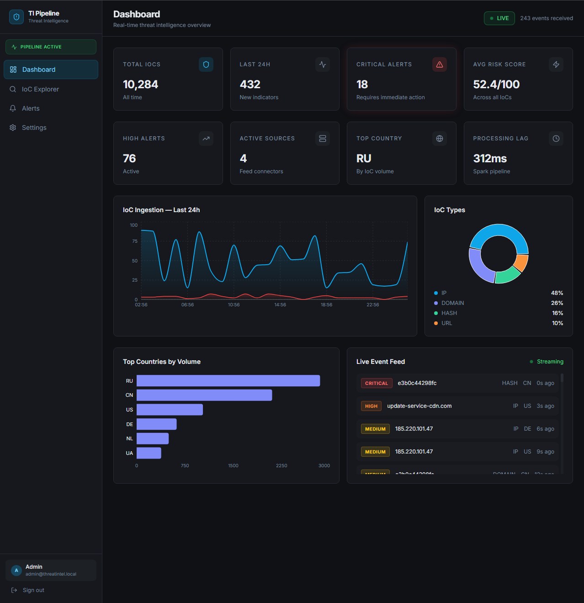

# 🛡️ Plataforma de Threat Intelligence en Tiempo Real

<div align="center">


**Plataforma de Threat Intelligence en tiempo real construida sobre Apache Spark Structured Streaming.**

Ingesta feeds de IoCs desde múltiples fuentes OSINT, los enriquece con datos de geolocalización y reputación, los puntúa con un modelo ML y los expone en un dashboard profesional para analistas SOC con streaming de eventos en vivo.

[Características](#-características) · [Arquitectura](#-arquitectura) · [Tech Stack](#-tech-stack) · [Inicio rápido](#-inicio-rápido) · [API](#-referencia-api) · [Roadmap](#-roadmap)

<br/>



</div>

---

## 📌 Descripción general

Este proyecto replica los flujos de trabajo reales de un Centro de Operaciones de Seguridad (SOC). El sistema ingesta continuamente **Indicadores de Compromiso (IoCs)** — IPs maliciosas, dominios, hashes de ficheros y URLs — desde feeds OSINT públicos, enriquece cada uno con metadatos contextuales, le asigna una **puntuación de riesgo** mediante ML y presenta alertas accionables a través de un dashboard moderno en dark mode.

Todo el ciclo de vida del dato está cubierto de extremo a extremo:

```
Ingesta → Kafka → PySpark Streaming → Enriquecimiento → Scoring ML → PostgreSQL → FastAPI → Next.js
```

> Desarrollado como proyecto de portfolio para demostrar ingeniería Big Data de nivel productivo combinada con experiencia en ciberseguridad.

---

## ✨ Características

### 🔄 Pipeline de streaming en tiempo real
- Ingesta de IoCs desde múltiples fuentes mediante tópicos de **Apache Kafka**
- Procesamiento con **PySpark Structured Streaming**
- Arquitectura de micro-batch con intervalos de 5 segundos
- Checkpoint automático y recuperación ante fallos

### 🌍 Integración con fuentes OSINT
| Fuente | Tipo | Tier gratuito |
|--------|------|---------------|
| **AbuseIPDB** | Reputación de IPs | 1.000 consultas/día |
| **VirusTotal** | Análisis de hashes y URLs | 500 consultas/día |
| **AlienVault OTX** | Feeds de la comunidad | Ilimitado |
| **Mock Feed** | Datos de desarrollo | Siempre disponible |

### 🧠 Scoring de riesgo con ML
- Motor de puntuación ponderada (0–100) basado en señales de enriquecimiento
- Features: puntuación AbuseIPDB, ratio de detección VirusTotal, flags Tor/VPN, confianza de la fuente
- Niveles de riesgo: `CRITICAL` · `HIGH` · `MEDIUM` · `LOW` · `INFO`
- Arquitectura extensible a un modelo Random Forest entrenado con PySpark MLlib

### 📊 Dashboard profesional para SOC
- **Next.js 14** con App Router y dark mode
- Feed de IoCs en tiempo real via **Server-Sent Events (SSE)**
- Gráficas interactivas: timeline de área, donut por tipo, barras por país
- Explorador de IoCs con filtros, búsqueda y paginación
- Gestión de alertas con filtros por severidad
- Autenticación JWT

### 🐳 Despliegue con un solo comando
- Stack completo con `docker-compose up -d`
- Servicios: Kafka, Zookeeper, Spark, PostgreSQL, FastAPI, Next.js
- Health checks, reinicio automático y apagado controlado

---

## 🏗️ Arquitectura

```
┌──────────────────────────────────────────────────────────────────────┐
│                      FUENTES DE DATOS OSINT                          │
│   AbuseIPDB    VirusTotal    AlienVault OTX    Generador Mock        │
└───────────────────────────────┬──────────────────────────────────────┘
                                │ Productores Kafka (Python)
                                ▼
┌──────────────────────────────────────────────────────────────────────┐
│                         APACHE KAFKA                                 │
│         [iocs.raw]      [iocs.enriched]      [alerts.critical]       │
└───────────────────────────────┬──────────────────────────────────────┘
                                │ Structured Streaming
                                ▼
┌──────────────────────────────────────────────────────────────────────┐
│                   CAPA DE PROCESAMIENTO PYSPARK                      │
│   Fuente Kafka → Deserialización → UDFs de enriquecimiento           │
│                                  → Scoring de riesgo ML              │
│                                  → Motor de reglas de alertas        │
│                                  → foreachBatch → PostgreSQL         │
└───────────────────────────────┬──────────────────────────────────────┘
                                ▼
┌──────────────────────────────────────────────────────────────────────┐
│       PostgreSQL 16 (almacenamiento caliente)   Parquet (archivo)    │
└───────────────────────────────┬──────────────────────────────────────┘
                                ▼
┌──────────────────────────────────────────────────────────────────────┐
│              FASTAPI — REST + SSE — Swagger en /docs                 │
└───────────────────────────────┬──────────────────────────────────────┘
                                ▼
┌──────────────────────────────────────────────────────────────────────┐
│      NEXT.JS 14 — Dashboard · Explorador IoC · Alertas · Config     │
└──────────────────────────────────────────────────────────────────────┘
```

---

## 🛠️ Tech Stack

| Capa | Tecnología | Versión | Propósito |
|------|-----------|---------|-----------|
| **Broker** | Apache Kafka | 3.7 | Cola de mensajes de eventos IoC |
| **Procesamiento** | PySpark Structured Streaming | 3.5 | Procesamiento distribuido en tiempo real |
| **ML** | PySpark MLlib | 3.5 | Modelo de scoring de riesgo |
| **API** | FastAPI + Uvicorn | 0.111 | Endpoints REST + feed SSE en vivo |
| **Base de datos** | PostgreSQL | 16 | Almacenamiento de IoCs y alertas |
| **Frontend** | Next.js App Router | 14 | Dashboard para analistas SOC |
| **Gráficas** | Recharts | 2.12 | Visualización de datos |
| **Infraestructura** | Docker Compose | — | Orquestación del stack completo |
| **CI/CD** | GitHub Actions | — | Tests y linting automatizados |

---

## 🚀 Inicio rápido

### Requisitos previos
- [Docker Desktop](https://www.docker.com/products/docker-desktop/) — mínimo 8 GB RAM
- [Git](https://git-scm.com/)

### 1. Clonar y configurar

```bash
git clone https://github.com/TU_USUARIO/realtime-threat-intelligence-platform.git
cd realtime-threat-intelligence-platform
cp .env.example .env
```

### 2. Arrancar el stack completo

```bash
docker-compose up -d
```

La primera ejecución tarda ~5 minutos en descargar las imágenes. Los arranques posteriores toman ~30 segundos.

### 3. Iniciar el generador de IoCs mock

```bash
docker-compose --profile dev up -d mock-feed
```

### 4. Abrir el dashboard

| Servicio | URL | Credenciales |
|----------|-----|--------------|
| **Dashboard** | http://localhost:3000 | admin@threatintel.local / changeme |
| **API Swagger** | http://localhost:8000/docs | — |
| **Health check** | http://localhost:8000/health | — |

---

## ⚙️ Configuración

Todos los valores tienen defaults funcionales. **Las API keys son opcionales** — el sistema usa datos mock realistas sin ellas.

```env
# API Keys OSINT (opcionales)
ABUSEIPDB_API_KEY=     # abuseipdb.com — gratis, 1000 req/día
VIRUSTOTAL_API_KEY=    # virustotal.com — gratis, 500 req/día
OTX_API_KEY=           # otx.alienvault.com — gratis, ilimitado

# Auth
JWT_SECRET=cambia_esto_por_un_secreto_seguro

# Mock feed
MOCK_FEED_INTERVAL_SECONDS=3
MOCK_FEED_BATCH_SIZE=5
```

---

## 📡 Referencia API

Documentación interactiva completa en `http://localhost:8000/docs`.

| Método | Endpoint | Descripción |
|--------|----------|-------------|
| `POST` | `/api/v1/auth/login` | Autenticación JWT |
| `GET` | `/api/v1/iocs` | Listar IoCs con filtros y paginación |
| `GET` | `/api/v1/iocs/{id}` | Detalle de un IoC |
| `POST` | `/api/v1/iocs/search` | Búsqueda avanzada de IoCs |
| `GET` | `/api/v1/alerts` | Lista de alertas activas |
| `GET` | `/api/v1/stats/summary` | Métricas del dashboard |
| `GET` | `/api/v1/stats/timeline` | Timeline de ingesta 24h |
| `GET` | `/api/v1/stats/by-country` | Volumen de IoCs por país |
| `GET` | `/api/v1/stream/iocs` | Feed SSE de IoCs en tiempo real |

---

## 🗺️ Roadmap

- [x] Stack Docker Compose completo (6 servicios)
- [x] Pipeline PySpark Structured Streaming
- [x] Productor Kafka con feed de IoCs mock
- [x] UDFs de enriquecimiento: geo, ASN y reputación
- [x] Motor de scoring de riesgo ponderado
- [x] Endpoints FastAPI REST + SSE + Swagger
- [x] Dashboard Next.js 14 — dark mode, gráficas, feed en vivo
- [x] Autenticación JWT
- [x] Pipeline CI GitHub Actions
- [ ] Integración en vivo con AbuseIPDB / VirusTotal / OTX
- [ ] Modelo Random Forest entrenado con PySpark MLlib
- [ ] Suite completa de tests unitarios e integración
- [ ] Manifiestos de despliegue en Kubernetes

---

## 📄 Licencia

Distribuido bajo licencia MIT. Ver `LICENSE` para más detalles.

---

<div align="center">

Desarrollado con ☕ y una sana paranoia sobre el tráfico de red.

</div>
